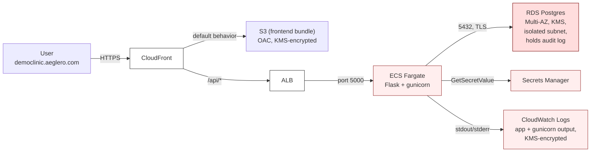
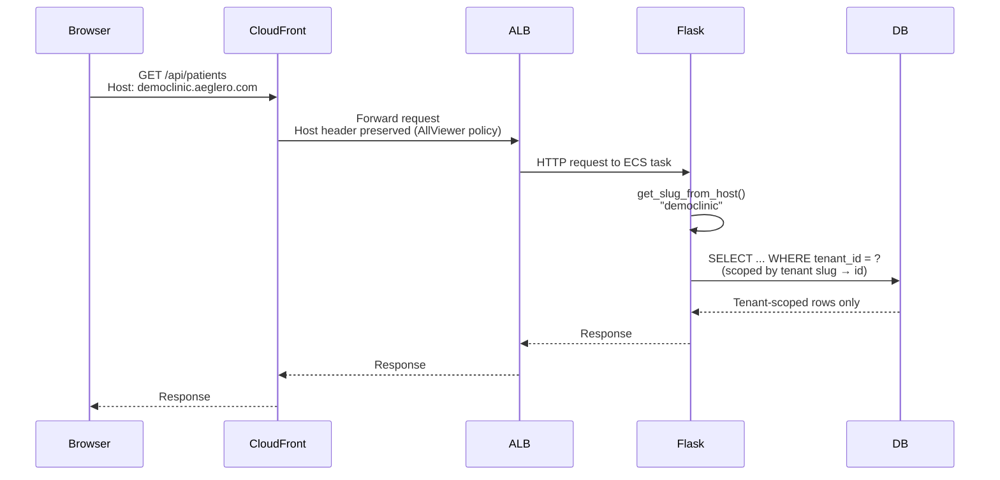
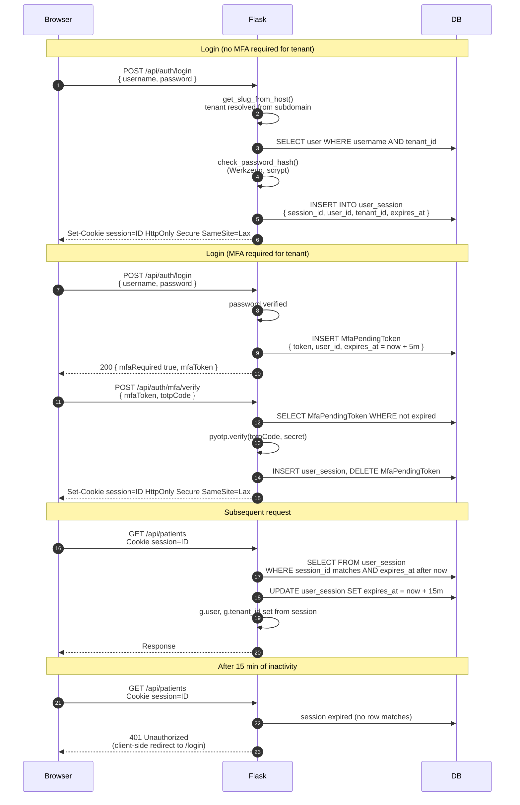
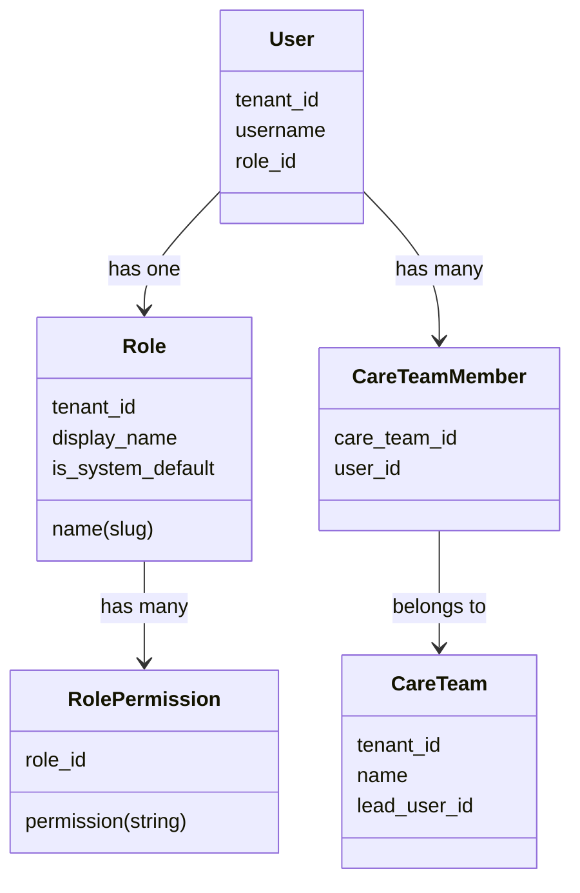
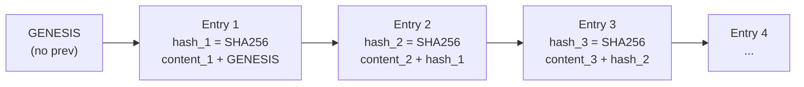
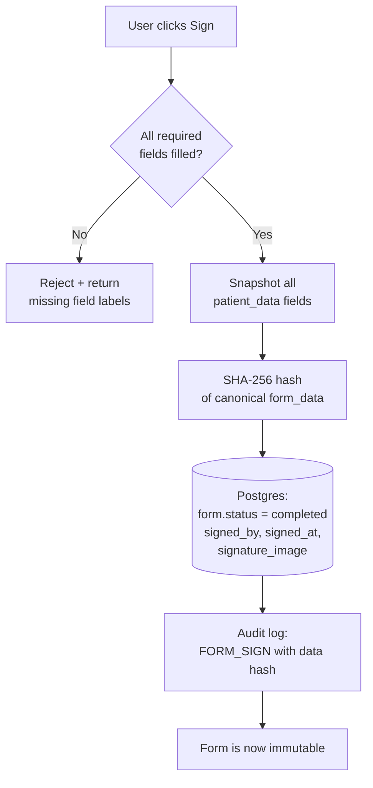
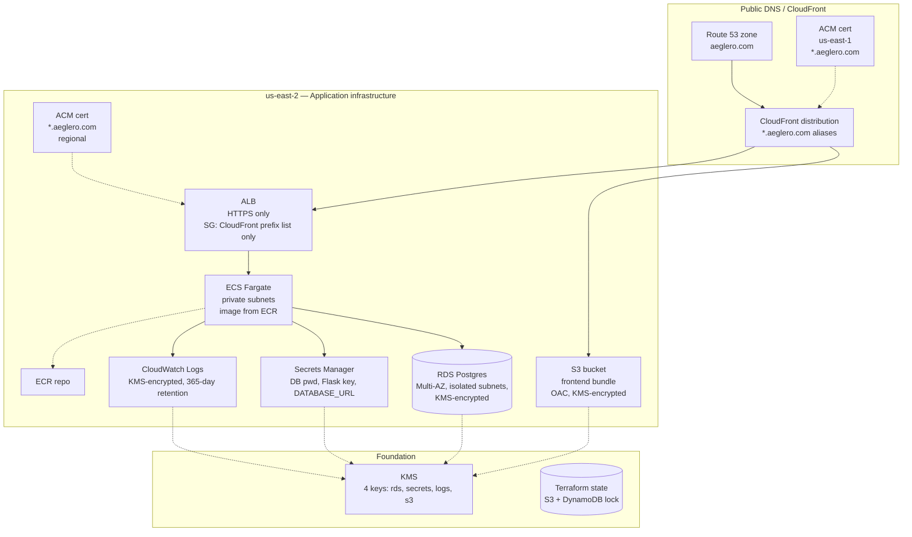

# Architecture

This document covers the system design choices that aren't obvious from reading the code: how multi-tenancy is enforced, how authentication works end-to-end, how the permission system layers role-based access with per-template overlays, and how the audit log achieves tamper-evidence with a SHA-256 hash chain.

If you're looking for the day-to-day-running-it stuff, [README.md](README.md) covers tech stack and how to run locally. If you're looking for the security control list mapped to HIPAA section numbers, [SECURITY.md](SECURITY.md) covers that.

---

## Table of contents

1. [System overview](#system-overview)
2. [Multi-tenancy model](#multi-tenancy-model)
3. [Authentication flow](#authentication-flow)
4. [Permission model](#permission-model)
5. [Audit log: hash-chained tamper evidence](#audit-log-hash-chained-tamper-evidence)
6. [Form templates and signed records](#form-templates-and-signed-records)
7. [Deployment topology](#deployment-topology)

---

## System overview



The frontend bundle and API live on the same hostname per tenant. CloudFront serves static assets from S3 by default and proxies `/api/*` to the ALB. Same-origin everywhere — no CORS, cookies are first-party automatically.

**Network tiers** (defense in depth):

| Tier | What lives here | Internet access |
|---|---|---|
| Public subnets | ALB, NAT Gateway | Yes (ingress/egress) |
| Private subnets | ECS Fargate tasks | Egress only via NAT |
| Isolated subnets | RDS Postgres | None at all |

The isolated subnets have no route to the Internet Gateway and no NAT route. RDS is genuinely unreachable from outside the VPC.

---

## Multi-tenancy model

Every clinic ("tenant") gets its own subdomain. The Host header is the canonical source of truth for which tenant a request belongs to.



### Where tenant_id is enforced

- **Schema**: every table that holds tenant data carries a non-nullable, indexed `tenant_id` foreign key. Unique constraints are scoped per-tenant (e.g., `uq_tenant_username`, `uq_tenant_patient_code`, `uq_tenant_role_name`). The same username, patient code, or role name can exist independently across tenants without colliding.
- **Auth middleware**: on every authenticated request, sets `g.tenant_id = user.tenant_id` from the session-resolved user.
- **Query helper**: `tenant_query(Model)` (in `services/helpers.py`) builds queries pre-scoped to `g.tenant_id`. Routes use this consistently rather than raw `Model.query`.
- **CloudFront origin request policy**: `AllViewer` forwards the original Host header to the ALB origin so the backend's slug parser sees `democlinic.aeglero.com`, not the CloudFront origin domain `api.aeglero.com`.

### Onboarding a new tenant

When a new clinic joins, Aeglero spins them up at their own subdomain (e.g. `acmedetox.aeglero.com`) and creates an initial administrator account. No code changes, no per-tenant infrastructure, no new CloudFront distributions. The wildcard cert and CloudFront aliases handle the routing automatically.

---

## Authentication flow

Sessions are server-issued, server-validated, and stored as a single `httpOnly` cookie. There are no client-side tokens (no localStorage, no sessionStorage). The session record is in Postgres; the cookie is a session ID.



### What's enforced

- **Sliding expiration**: every authenticated request bumps `expires_at` 15 min into the future. 15 min idle = logged out.
- **Cookie hardening**: `httpOnly` (no JS access), `Secure` (HTTPS only), `SameSite=Lax` (CSRF protection).
- **No token storage on the client**: a `session=` cookie is the only persistent client state. The cookie value is a database key, not a JWT — server can revoke instantly.
- **Account lockout**: after 5 consecutive failed logins, account is locked. Admin must unlock.
- **Permanent lock**: an admin can flip `permanently_locked = true`; this also kills every active session for that user immediately.
- **Password reset**: admin-driven only (no self-service reset endpoint). Reset kills all active sessions.

### MFA (TOTP)

MFA is per-tenant configurable. When `tenant.mfa_required = true`:

- Users without MFA configured are redirected to a setup screen on next login (QR code + 6-digit verification)
- Users with MFA must provide a 6-digit code on login
- Users cannot disable their own MFA while the tenant flag is on
- All MFA events (setup, enable, disable, verify, fail) are audit-logged

---

## Permission model

The permission system is two-axis:

- **Roles** (vertical access): what capabilities does this user have?
- **Care Teams** (horizontal access): whose patient records can this user see?

A clinician with the `clinical_staff` role and membership in the "Detox Day Shift" care team can edit clinical records *for patients assigned to that team only*. That same clinician at the same role but on the "Residential Team" sees a different set of patients with the same edit capabilities.

### Roles



Each role has a flat list of `RolePermission` rows. The permission strings are namespaced (e.g. `patients.view`, `frontdesk.beds.manage`, `archive.forms.manage`). System default roles are seeded via migration; tenants can create unlimited custom roles.

The frontend builder enforces **dependency rules** so you can't construct broken roles. Checking "Manage Beds" auto-checks "View Front Desk" because the latter is required. Unchecking a base auto-removes its dependents. See `frontend/components/manage-roles-view.tsx:191-216` for the rule table and resolution logic.

### Care Teams (visibility scope)

Care Team membership controls patient visibility at query time:

- A user with `patients.view.all` sees every patient regardless of team
- A user with only `patients.view` (no `.all`) sees only patients whose `care_team_id` is in the user's team membership list, plus patients with `care_team_id IS NULL` ("Everyone")

This is enforced in `routes/patients.py:_apply_rbac()`, which adds the appropriate `WHERE` clause to every list query.

### Per-template access overlay

Form templates have their own access matrix that's *more granular* than role-level permissions. Each template-role pairing has one of four states:

- **None** — template invisible to this role
- **View** — can see existing forms but not fill or edit
- **Edit** — can fill drafts, save in progress
- **Sign** — can fill and lock as completed (legal record)

This means within the same role, a user might be able to *edit* a Biopsychosocial but only *view* a Discharge Summary, and *sign* a Daily Progress Note. Configurable per template.

Admin role always has Sign access on every template (system rule, not stored — see `routes/forms.py:_get_access_level()`).

---

## Audit log: hash-chained tamper evidence

Every meaningful action — login, view, edit, sign, delete, role change, MFA event, discharge, etc. — writes a row to the audit log. Logs are per-tenant and tamper-evident via a SHA-256 hash chain.

### Schema

```sql
CREATE TABLE audit_log (
    id          BIGSERIAL PRIMARY KEY,
    tenant_id   INT NOT NULL,
    timestamp   TIMESTAMPTZ NOT NULL,
    user_id     INT,
    action      VARCHAR,    -- e.g. PATIENT_VIEW, FORM_SIGN, ROLE_UPDATE
    resource    VARCHAR,    -- e.g. patient/PT-009, form/123
    status      VARCHAR,    -- SUCCESS / FAILED
    ip_address  VARCHAR,
    description TEXT,
    prev_hash   VARCHAR,    -- hash of the previous row in this tenant
    entry_hash  VARCHAR     -- SHA-256(content || prev_hash)
);
```

### How the hash chain works



For each new audit row, we compute:

```python
entry_hash = SHA256(timestamp | tenant_id | user_id | action | resource
                    | status | ip_address | description | prev_hash)
```

`prev_hash` is the previous row's `entry_hash` (or "GENESIS" for the first row in a tenant). The chain is per-tenant — each tenant has its own genesis and independent chain.

### Why this matters

Modify any past row — even a single character in `description` — and that row's `entry_hash` becomes wrong. Every subsequent row's `prev_hash` reference is now broken too. The break propagates forward through every later row.

**Detection**: a `GET /api/audit/verify` endpoint walks the entire chain for the tenant and returns:

```json
{
    "intact": false,
    "total_entries": 14283,
    "broken_entries": 1,
    "details": [
        { "id": 6829, "timestamp": "...", "expected_hash": "abc...", "actual_hash": "def..." }
    ]
}
```

This is genuinely uncommon in EMR audit logs — most just trust the database. With the hash chain, even a privileged DBA running raw SQL `UPDATE audit_log` can't silently rewrite history. They have to either rebuild the entire downstream chain (computationally and operationally hard, and externally observable in CloudTrail) or accept that the verification will fail.

This satisfies **ONC §170.315(d)(2)** tamper-resistance for audit data.

### PHI-aware logging

For sensitive field types (text, textarea, signature), the audit log records "field X: changed" rather than the actual content:

- A clinician edits a Biopsychosocial → log says `Saved draft of 'Biopsychosocial' for John Doe (PT-009) — Mood: changed; Substance use history: changed`
- The log doesn't contain the clinical narrative

This prevents the audit log from becoming a second copy of PHI — important because audit logs often have weaker access controls than primary records.

### Autosave dedup

Draft form saves trigger a `FORM_UPDATE` log. Without deduplication, autosave-every-keystroke would flood the log with thousands of identical events. We dedup at the (user_id, form_id) level within a 10-minute window.

Sign and delete events are **never** deduped — those are high-signal compliance events.

---

## Form templates and signed records

Form templates are user-definable per tenant. Once an instance is signed, it becomes an immutable legal record.

### Field types

15 supported field types: text, textarea, number, date, time, yes/no, check-all-that-apply, dropdown, multi-select, scale, matrix/grid, signature (canvas-drawn), patient-data, section break, title.

The patient-data field type is the standout: the field references a patient property (e.g. `dateOfBirth`, `currentLoc`, `careTeamName`). At sign time, the current value of that property is **snapshotted** into the form's saved data. If the patient's care team changes three years later, the signed form still shows the team that was true at signing.

### Sign-time behavior



After signing:
- `form.status = 'completed'` — UPDATE blocked at the route level
- The `FORM_SIGN` audit entry contains the SHA-256 of the canonical form data
- Combined with the hash-chained audit log, this gives cryptographic proof that the signed contents haven't been altered after the fact
- Deletion requires the separate `forms.delete_completed` permission (rare grant)

---

## Deployment topology

Everything is in AWS, single account, region `us-east-2`. Cert for CloudFront is the only thing that has to live in `us-east-1` (CloudFront's hard requirement).



### Module breakdown

| Module | Purpose |
|---|---|
| `infra/bootstrap/` | One-time: state S3 bucket + DynamoDB lock + dedicated KMS key. Run with local state, then migrate. |
| `infra/network.tf` | VPC, 6 subnets across 2 AZ, NAT, IGW, route tables, security groups, VPC Flow Logs |
| `infra/kms.tf` | 4 customer-managed KMS keys with annual rotation |
| `infra/secrets.tf` | Secrets Manager entries — auto-generated DB password and Flask SECRET_KEY |
| `infra/rds.tf` | Multi-AZ Postgres, encrypted, isolated subnet, 7-day backups, PITR, force_ssl |
| `infra/ecr.tf` | Backend image repository with 20-image lifecycle policy |
| `infra/ecs.tf` | ECS cluster + Fargate task + service with `enable_execute_command` for ops |
| `infra/alb.tf` | ALB + target group + HTTPS listener + ACM cert (regional) |
| `infra/frontend.tf` | S3 bucket + OAC + bucket policy |
| `infra/cloudfront.tf` | CloudFront distribution + ACM cert (us-east-1) + DNS records |

### Network defense in depth

The ALB security group ingress is locked to the CloudFront managed prefix list (`com.amazonaws.global.cloudfront.origin-facing`). Even though `api.aeglero.com` resolves publicly to the ALB IPs, only CloudFront edges can connect — direct hits from anywhere else are rejected at the SG layer.

The ECS task security group only accepts ingress from the ALB SG. The RDS security group only accepts ingress from the ECS SG. And RDS lives in isolated subnets with no internet route, so even if the SG were misconfigured, RDS couldn't make external connections.

### Secrets at runtime

ECS Fargate pulls the DB connection string and Flask SECRET_KEY from Secrets Manager at task start, injecting them as environment variables via the task definition's `secrets` mapping. The task execution role's IAM policy is scoped to those specific secret ARNs and the secrets KMS key — `kms:Decrypt` on any other key is denied.

Secrets never appear in:
- Terraform state files (state holds Secrets Manager *ARNs*, not values)
- CloudFormation/Terraform plan output
- Container environment at build time
- CloudWatch logs (the env vars are masked when logged by ECS agent)

---

## Further reading in this repo

- [SECURITY.md](SECURITY.md) — security policy, vulnerability disclosure process, HIPAA mapping
- [README.md](README.md) — overview, tech stack, run instructions
- `backend/services/audit_logger.py` — hash chain implementation
- `backend/routes/audit.py` — `/audit/verify` endpoint
- `frontend/components/manage-roles-view.tsx` — role + permission dependency UI
- `infra/network.tf` — VPC topology with comments
