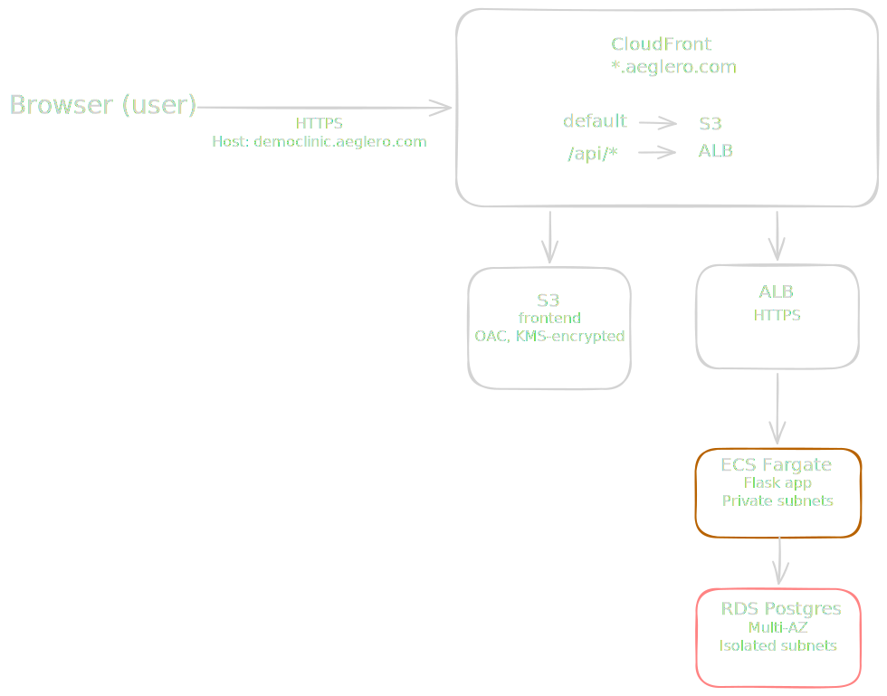
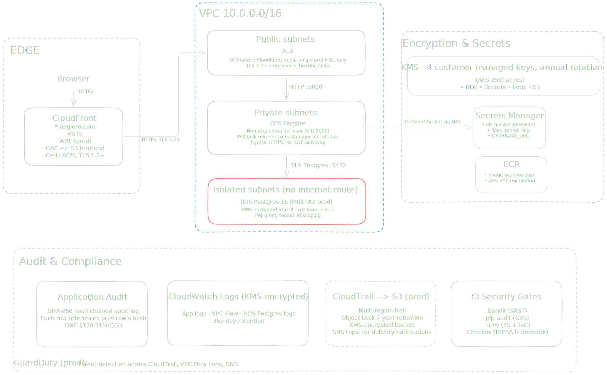
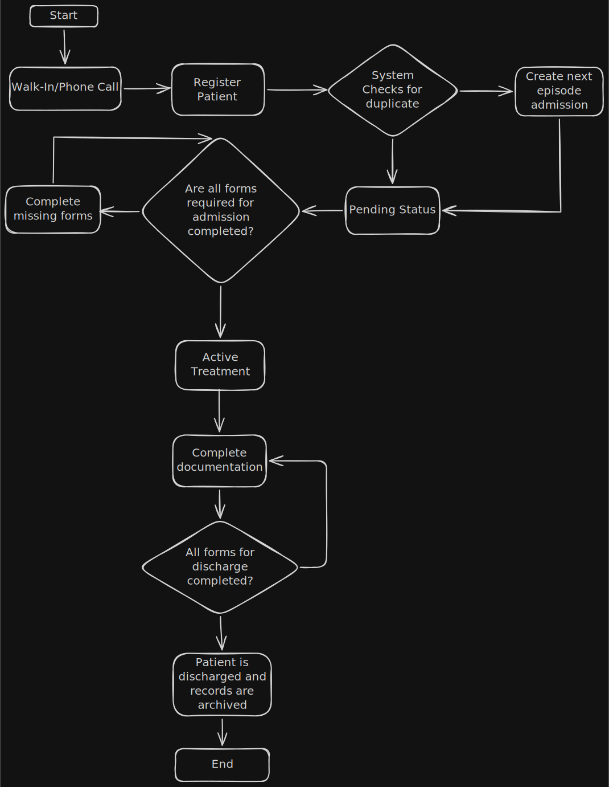
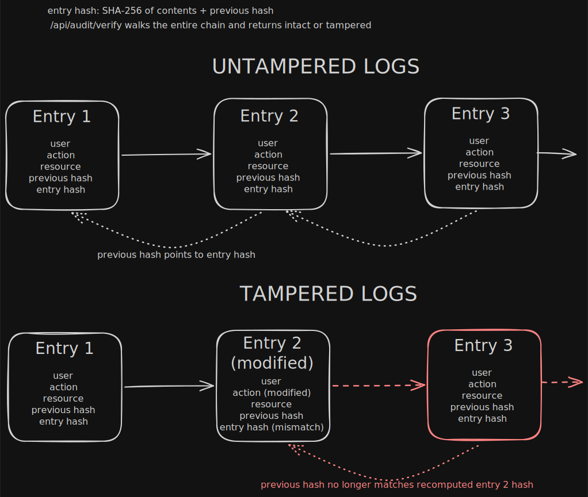

<p align="center">
  
</p>

<h1 align="center">Aeglero EMR</h1>

<p align="center">
  Multi-tenant EMR built specifically for residential addiction and behavioral health treatment programs.<br>
  HIPAA-grade access controls, 42 CFR Part 2 consent management, and a tamper-evident hash-chained audit log.
</p>

<p align="center">
  <a href="https://www.aeglero.com">aeglero.com</a> &middot;
  <a href="https://democlinic.aeglero.com">democlinic.aeglero.com</a> (available on request) &middot;
  <a href="ARCHITECTURE.md">Architecture</a> &middot;
  <a href="SECURITY.md">Security</a>
</p>

<p align="center">
  
  
  
  
  
  
  
  
</p>

---

## Built for residential treatment

Detox and rehab clinics operate under conditions you don't see in regular healthcare. Round-the-clock admissions and discharges, withdrawal monitoring on rigid schedules, federal SUD confidentiality rules layered on top of HIPAA, and high stakes from the moment a patient walks in. The staff handling all of that are clinicians and counselors, not data-entry specialists.

Aeglero takes the operational complexity off their plate. Beds, episodes, consents, required-form gates, and audit trails are all first-class concepts in the system. Clinical staff focus on the patient. The software handles the rest.

<h3 align="center">Welcome to Aeglero!</h3>
<p align="center">
  <video src="https://github.com/user-attachments/assets/898b2f0c-6055-4e2c-aab1-40f320f92707" controls width="70%"></video>
</p>

<p align="center">
  <a href="https://www.youtube.com/watch?v=9aTmj40FKGs">
    
  </a>
</p>

## Tech stack

| Layer | Stack |
|---|---|
| **Frontend** | Next.js 16 (app router, static export), React 19, TypeScript, Tailwind 4, shadcn/Radix UI |
| **Backend** | Python 3.12, Flask, SQLAlchemy 2, Alembic, gunicorn |
| **Database** | PostgreSQL 16 with strict `tenant_id` scoping enforced on every query |
| **Auth** | httpOnly session cookies, 15-min sliding expiration, TOTP MFA (per-tenant enforced) |
| **Audit log** | SHA-256 hash chain (per-tenant), with each row's hash incorporating the previous row's hash |
| **Infrastructure** | AWS (ECS Fargate, RDS Multi-AZ, ALB, CloudFront, S3 with OAC, KMS, Secrets Manager, Route 53) |
| **IaC** | Terraform with S3 + DynamoDB remote state |
| **CI/CD** | Docker images via ECR, ECS rolling deployments |

## Architecture at a glance

<p align="center">
  
</p>

Each clinic gets its own subdomain (e.g. `democlinic.aeglero.com`). The Host header is parsed to a tenant slug at the start of every request and applied as a `tenant_id` filter to every database query. CloudFront serves the static frontend bundle from S3 by default and proxies `/api/*` to the ALB, so frontend and API live on the same origin. No CORS, cookies first-party.

For the multi-tenancy model, auth flow, permission system, and audit-log integrity scheme, see [ARCHITECTURE.md](ARCHITECTURE.md).

## Security architecture

<p align="center">
  
</p>

Three-tier subnet isolation enforces network boundaries — public for the ALB, private for ECS Fargate, isolated (with no internet route) for RDS. Four customer-managed KMS keys with annual rotation cover RDS, Secrets Manager, CloudWatch Logs, and S3. A SHA-256 hash-chained audit log lives in the database, with each entry referencing the previous entry's hash so any modification is mathematically detectable (ONC §170.315(d)(2)). CloudTrail, WAF, and GuardDuty are controlled by production feature flags, and every CI pipeline run gates merges on Bandit, pip-audit, Trivy, and Checkov scans.

For the full control catalog mapped to HIPAA §164.312 and 42 CFR Part 2, see [SECURITY.md](SECURITY.md).

## Key features

### Clinical workflow

<p align="center">
  
</p>

- **Live bed board** with units (Detox, Stabilization, Residential), color-coded status (occupied, available, cleaning, out-of-service), and atomic transfers
- **Episode-based records**. Every admission opens a fresh Episode. Readmissions create Episode #2, #3, and so on without overwriting history
- **Required-form gates**. Admission and discharge are blocked until templates marked `required_for_admission` or `required_for_discharge` are completed for the current episode
- **Recurring templates** with intervals (e.g. q8h CIWA-Ar). Drafts auto-generate when the previous instance is signed and the interval has elapsed
- **Acuity flags** surfaced at the top of every patient chart. Seizure history, suicide risk, severe withdrawal risk, elopement risk, pregnancy, infectious disease precaution, fall risk, cardiac risk
- **42 CFR Part 2 consent management**. Track consents by recipient, expiration, and purpose. Revocations are first-class audit events.

### Documentation builder

- **15 field types**: text, textarea, number, date, time, yes/no, check-all-that-apply, dropdown, multi-select, scale, matrix/grid, signature (canvas-drawn), patient-data (auto-fills and snapshots at sign), section break, title
- **Patient-data fields snapshot 22 patient properties** (DOB, age, insurance, current Level of Care, primary diagnosis, care team, etc.) into the form at sign time. Values are frozen at the moment of signing for legal-record integrity
- **Three-tier per-template role access**: View, Edit, Sign. Far more granular than role-or-no-role
- **Immutable signed forms**. Completed forms cannot be edited. Deletion requires the separate `forms.delete_completed` permission

### Access control

- **Two-axis access**: Roles (capabilities) by Care Teams (patient visibility scope). A clinician can have edit rights and only see patients assigned to their team
- **Smart permission dependencies**. Checking "Manage Beds" auto-checks "View Front Desk". Unchecking the base auto-removes dependents. Prevents broken roles where a user has "edit" without "view"
- **System default roles** seeded from migration. Unlimited custom roles per tenant
- **MFA enforcement**. Toggle on or off facility-wide

### Tamper-evident audit log

<p align="center">
  
</p>

- **SHA-256 hash chain**. Every audit row's hash incorporates the previous row's hash. Tampering with any past entry invalidates every subsequent hash
- **One-click integrity verification**. `GET /api/audit/verify` walks the entire chain for your clinic and returns INTACT or TAMPERED with the specific row IDs that don't add up. Satisfies ONC §170.315(d)(2)
- **Per-form SHA-256 on signed records**. Combined with the hash chain, this provides cryptographic proof that signed clinical forms have not been altered after the fact
- **PHI-aware logging**. For sensitive field types (text, textarea, signature), the log records "field X: changed" rather than the actual content. The audit log itself does not become a second copy of clinical narrative

### Security highlights

- AES-256 encryption at rest via AWS KMS customer-managed keys (RDS, Secrets Manager, S3, CloudWatch Logs) with annual rotation
- TLS 1.2+ enforced everywhere (CloudFront `TLSv1.2_2021`, ALB `ELBSecurityPolicy-TLS13-1-2-2021-06`, Postgres `rds.force_ssl=1`)
- Three-tier subnet isolation. RDS lives in isolated subnets with no internet route at all
- ALB ingress restricted to the AWS-managed CloudFront prefix list. The API isn't reachable from anywhere except CloudFront edges
- Hardened response headers (HSTS, CSP, X-Frame-Options DENY, X-Content-Type-Options nosniff, Cache-Control no-store)
- Strong password policy (12+ chars, mixed case, digits, special) with Werkzeug scrypt hashing
- Account lockout after 5 failed logins. Permanent lock kills all active sessions instantly

See [SECURITY.md](SECURITY.md) for the full controls list and HIPAA Security Rule mapping.

## Documentation

- **[ARCHITECTURE.md](ARCHITECTURE.md)** for the deep dive: multi-tenancy model, auth flow, permission model, audit-log integrity, deployment topology
- **[SECURITY.md](SECURITY.md)** for the security policy: vulnerability reporting, technical controls catalogue, HIPAA Security Rule §164.312 mapping, ONC certification criteria, 42 CFR Part 2 alignment
- **[aeglero.com](https://www.aeglero.com)** for product features, screenshots, learning videos, and contact

## Project structure

```
AegleroEMR/
├── backend/             Flask app
│   ├── app.py           entrypoint, security headers, blueprint registration
│   ├── models.py        SQLAlchemy models (every PHI table has tenant_id)
│   ├── auth_middleware.py  session validation, permission decorator
│   ├── routes/          blueprints (auth, patients, forms, audit, etc.)
│   ├── services/        audit_logger, helpers, password_validator
│   └── migrations/      Alembic
├── frontend/            Next.js EMR app (static export)
│   ├── app/             app router pages
│   ├── components/      all the views (patients, manage-roles, etc.)
│   └── lib/api.ts       API client (cookie-based session)
├── infra/               Terraform
│   ├── bootstrap/       one-time state backend setup
│   └── *.tf             main stack
├── ARCHITECTURE.md      deep-dive on system design
└── SECURITY.md          security policy and HIPAA mapping
```

## License

Released under the [GNU Affero General Public License v3.0](LICENSE). You're free to study, fork, modify, and redistribute. The AGPL adds one important condition over more permissive licenses: if you run a modified version as a network service (SaaS), you must release your source modifications under the same license. This protects the project from being forked into a closed-source competing service.

Aeglero, the project name and brand, are reserved.

## Contact

For partnership, demo requests, or general inquiries: **contact@aeglero.com**
